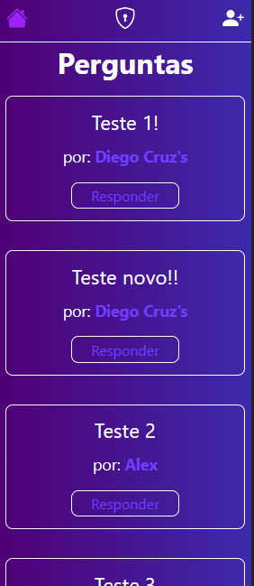
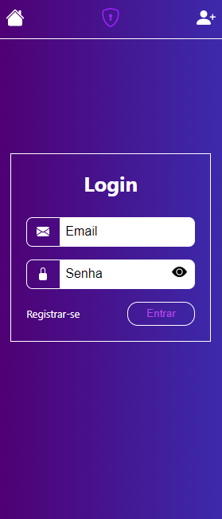
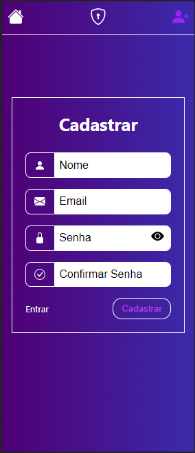
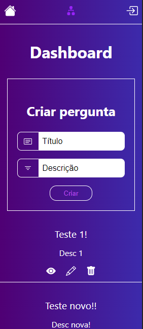
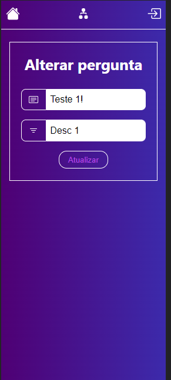
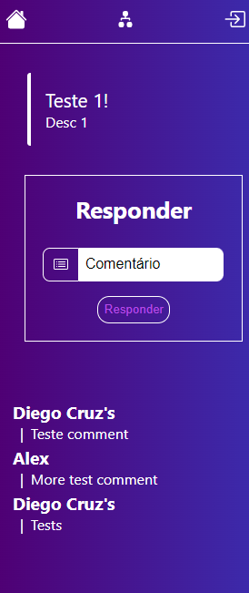

# Quesans

# Imagens do projeto



<br />
<p>Após o login/cadastro</p>



<p>OBS: projeto não foi desenvolvido pensando no mobile, apenas reduzir as imagens no navegador para printar com maior facilidade</p>

## Sobre o projeto
<hr />
<a href="https://github.com/diegocruz-s/quesans/blob/master/licence">
    
</a>
<p>O projeto consiste em criar perguntas, que serão exibidas no Home, para aguardar respostas de outros usuários(que devem estar logado no sistema para responder uma pergunta)</p>
<p>O projeto conta com opções de ver, alterar, editar ou deletar uma pergunta(CRUD) e conta também com um sistema de autenticação utilizando token através do <a href="https://jwt.io/introduction">JWT</a></p>

# Tecnologias utilizadas
## Back end
- Nodejs
- MySQL
- JWT

## Front end
- HTML / CSS
- React

<p>Utilizei o Figma para construir os modelos do front end. <a href="https://www.figma.com/file/yrDaPJz6yviBrpnbRm7C6w/Untitled?node-id=0%3A1">Clique aqui</a> para ver os modelos</p>


## Executando o projeto
## Back end
```bash
    # clonar o repositório
    git clone https://github.com/diegocruz-s/quesans

    # criar um arquivo .env na raiz do diretório backend
    Necessário pois não subi a aplicação, foi um projeto feito apenas para treinar os meus estudos
        # Arquvio .env
        PORT=5000
        SECRET_TOKEN='string que você escolher'
        NAME_DB='newquesans'
        USER_DB='root'
        PASS_DB=''

    # entrar na pasta backend
    cd backend

    # instalar dependências
    npm install

    # executar o projeto
    npm start
```

## Front end
```bash
    # clonar repositório
    git clone https://github.com/diegocruz-s/quesans

    # entrar na pasta frontend
    cd frontend

    # instalar dependências
    npm install

    # exucutar o projeto
    npm start
```

## Autor 
<hr />
<p>Diego Cruz's</p>
<a href="https://www.linkedin.com/in/diego-cruz-56436b248/">https://www.linkedin.com/in/diego-cruz-56436b248/</a>